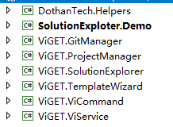

# 项目集成说明文档

## 一、项目结构说明


- Demo项目：
    - SolutionExplorer.Demo;
    测试项目；
- 类库项目：
    - DothanTech.Helpers:
    工具类库，包含一些常用的工具类；
    - ViGET.ViCommand:
    项目中所用到的一些命令及命令相关的操作；
    - ViGET.ViService:
    为了实现项目的模块化，以及模块与模块之间进行解耦和，因此需要定义一些全局的接口供模块与模块之间调用。
- 模块项目：
    - ViGET.SolutionExplorer:
    解决方案管理器模块，用于实现项目及项目中相关子项目的增删查改操作等；
    - ViGET.TemplateWizard:
    新建 Project，及ProjectItem向导模块。
    - ViGET.GitManager:
    Git操作模块，通过该模块可以实现代码版本控制相关操作；

## SolutionExplorer项目集成方法：

1. 导入除SolutionExplorer.Demo之外的所有项目;
2. 在项目主框架中组装模块项目：

模块组装方法一：加载制定文件夹下的所有类库
```C#
private void Compose()
{
    // 加载可执行文件夹下的所有模块；
    var dir = new DirectoryCatalog(".");
    var catalog = new AggregateCatalog();
    catalog.Catalogs.Add(dir);

    var container = new CompositionContainer(catalog);
    container.ComposeParts(this);
}
```
模块组装方法二：根据需要，手动的按需加载模块：
```C#
private void Compose()
{
    // 本次项目中只有下列三个项目为模块项目，其他项目只是类库项目；
    var catalog = new AggregateCatalog();
    catalog.Catalogs.Add(new AssemblyCatalog(typeof(TemplateWizard).Assembly));
    catalog.Catalogs.Add(new AssemblyCatalog(typeof(ProjectFactory).Assembly));
    catalog.Catalogs.Add(new AssemblyCatalog(typeof(ViGitManager).Assembly));
    
    var container = new CompositionContainer(catalog);
    container.ComposeParts(this);
}
```
3. 添加SolutionExplorer导入属性：
```C#
    [Import(typeof(UcSolutionExplorer))]
    public UserControl SolutionExplorer { get; set; }

    [Import]
    public IProjectFactory ProjectFactory { get; set; }
```
4. 在主框架的xaml文件中绑定 SolutionExplorer属性：
```C#
    ...
    <avalon:LayoutAnchorablePane
        DockWidth="250">
        <avalon:LayoutAnchorable
            Title="Solution Explorer" ContentId="SolutionExplorer">
            <ContentControl Content="{Binding SolutionExplorer}"/>
        </avalon:LayoutAnchorable>
    </avalon:LayoutAnchorablePane>
    ...
```
5. 当MEF模块组装完成后，执行相关的初始化操作：
```C#
    public void OnImportsSatisfied()
    {
        this.ProjectFactory.DocOpening += this.onDocumentOpening;
        this.ProjectFactory.StartBuilding += this.OnStartBuilding;
        this.ProjectFactory.BuildStop += this.OnBuildStop;
    }
```
6. 详情可参考Demo中的代码；